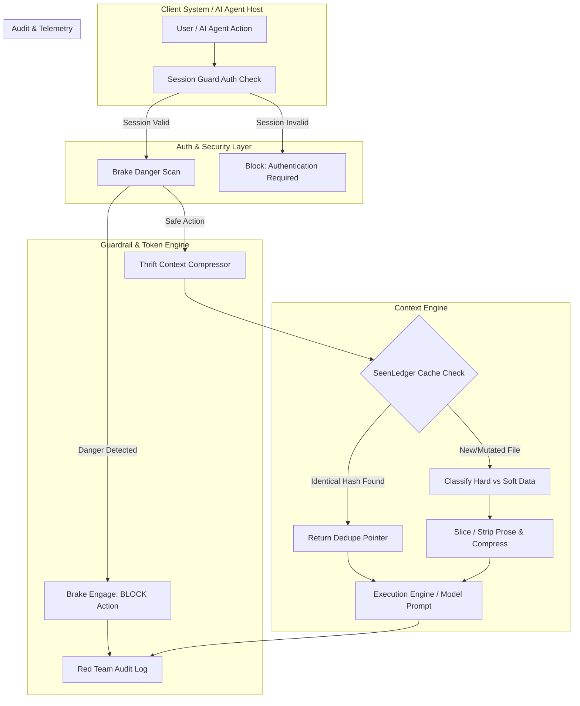

# SYSTEM ARCHITECTURE & DATAFLOW SPECIFICATION

## Overview

The Lyceum security and context optimisation suite consists of four tightly integrated, modular components designed for AI Agent systems:

1. **`@lyceum/session-guard`**: Session authentication and master key management.
2. **`brake`**: Emergency safety brake, threat scanner, and SLA enforcement guardrail.
3. **`thrift` (Savier)**: Token economy engine, context deduplication (`SeenLedger`), and semantic compressor.
4. **`redteam`**: Automated security audit log recorder and usage telemetry tracker.

---

## Dataflow Architecture

---

## Component Responsibilities

| Component | Responsibility | Latency Budget | Fail-Safe Behavior |
| :--- | :--- | :--- | :--- |
| **Session Guard** | Master password authentication, token issuance, session TTL. | $< 0.1\text{ms}$ | Lock session on invalid/expired token. |
| **Brake** | Regex & pattern scanning for RCE, data exfiltration, SQLi, PII leaks, destructive ops. | $< 1.0\text{ms}$ | Block dangerous operations immediately. |
| **Thrift (Savier)** | Deduplication (`SeenLedger`), CRLF normalization, token budget slicing. | $< 10.0\text{ms}$ | Fall back to uncompressed input if growth occurs. |
| **Red Team** | Persistent audit logging to `~/.brake/audit.log` & `~/.thrift/ledger.log`. | Async | Non-blocking append. |
